# Manual de Usuario — Nómina Xpress

Guía práctica para usar el sistema. Está escrita para el **usuario final** (dueño,
administrador y empleados del restaurante), no para desarrolladores. Explica, paso a
paso, cómo usar cada funcionalidad.

> **Sobre las capturas de pantalla:** las imágenes de este manual son capturas reales de
> la aplicación con datos de demostración. Se regeneran con
> `npm run docs:screenshots` (ver [sección 23](#23-cómo-actualizar-este-manual))
> y viven en `docs/img/`.

## Índice

- [1. Conceptos básicos](#1-conceptos-básicos)
- [2. Iniciar y cerrar sesión](#2-iniciar-y-cerrar-sesión)
- [3. Roles: quién puede hacer qué](#3-roles-quién-puede-hacer-qué)
- **Área de administración**
  - [4. Dashboard](#4-dashboard)
  - [5. Personal (empleados)](#5-personal-empleados)
  - [6. Registro de horas](#6-registro-de-horas)
  - [7. Horarios](#7-horarios)
  - [8. Propinas](#8-propinas)
  - [9. Bonos y descuentos](#9-bonos-y-descuentos)
  - [10. Ajustes de pago](#10-ajustes-de-pago)
  - [11. Reportes de nómina (PDF/Excel)](#11-reportes-de-nómina-pdfexcel)
  - [12. Reportes de turnos](#12-reportes-de-turnos)
  - [13. Usuarios](#13-usuarios)
  - [14. Roles y permisos](#14-roles-y-permisos)
  - [15. Auditoría](#15-auditoría)
  - [16. Festivos](#16-festivos)
  - [17. Configuración del restaurante](#17-configuración-del-restaurante)
  - [18. Mi perfil](#18-mi-perfil)
- **Portal del empleado**
  - [19. Mi Quincena](#19-mi-quincena)
  - [20. Mi Horario](#20-mi-horario)
  - [21. Perfil del empleado y notificaciones](#21-perfil-del-empleado-y-notificaciones)
- [22. Preguntas frecuentes](#22-preguntas-frecuentes)
- [23. Cómo actualizar este manual](#23-cómo-actualizar-este-manual)

---

## 1. Conceptos básicos

- **Quincena (período):** la nómina se maneja por quincenas. Del **día 1 al 15** es la
  primera; del **16 al fin de mes**, la segunda.
- **Tarifa normal vs. especial:** los **domingos y festivos** se pagan con la **tarifa
  especial** (más alta). El sistema lo detecta automáticamente usando el calendario de
  **festivos nacionales colombianos** más los **festivos personalizados** que registres
  (ver [sección 16](#16-festivos)).
- **Menaje:** al registrar propinas, el sistema aparta un **10%** (menaje) y reparte el
  resto entre los empleados según sus horas.
- **Turno que cruza la medianoche:** un turno puede terminar en la madrugada del día
  siguiente, **hasta las 2:00 a. m.** Esas horas se pagan con la tarifa del **día en que
  empezó** el turno.
- **Roles:** determinan qué puede ver y hacer cada persona (ver [sección 3](#3-roles-quién-puede-hacer-qué)).

---

## 2. Iniciar y cerrar sesión

**Propósito:** entrar al sistema con tu cuenta.
**Quién:** todos los usuarios.

**Pasos:**
1. Abre la dirección del sistema en el navegador.
2. Escribe tu **nombre de usuario** (no es un correo) y tu **contraseña**.
3. Presiona **Ingresar**.
4. El sistema te lleva a tu pantalla inicial: **administradores** → Dashboard;
   **empleados** → Mi Quincena.

**Datos requeridos:** usuario y contraseña.
**Resultado esperado:** acceso a la pantalla correspondiente a tu rol.

**Para cerrar sesión:** usa **Cerrar sesión** (parte inferior del menú lateral en el
área admin, o **Salir** arriba a la derecha en el portal del empleado).

**Errores / situaciones comunes:**
- *Usuario o contraseña incorrectos:* verifica mayúsculas/minúsculas.
- *Cuenta desactivada:* un administrador debe reactivarla; los intentos quedan
  registrados en la auditoría.

**Recomendación:** cambia tu contraseña inicial desde tu perfil la primera vez.

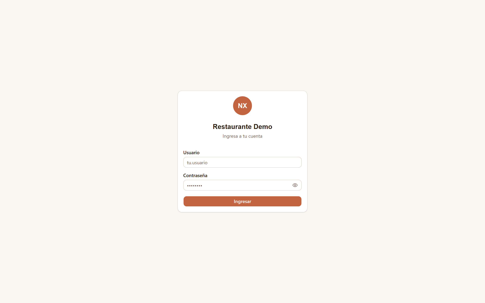

---

## 3. Roles: quién puede hacer qué

| Rol | Qué puede hacer (resumen) |
|---|---|
| **Propietario (PROPRIETARY)** | Todo. Único que ve la **Auditoría** y gestiona **roles/permisos** por defecto. |
| **Superadministrador (SUPERADMIN)** | Gestión completa: personal, horas, horarios, propinas, nómina, bonos, descuentos, ajustes, **festivos** y configuración. |
| **Administrador (ADMIN)** | Operación diaria: horas, ver horarios, propinas, nómina y reportes. No gestiona personal, bonos/descuentos ni festivos. |
| **Empleado (EMPLOYEE)** | Solo su portal (Mi Quincena, Mi Horario, Perfil), salvo que reciba permisos extra. |

> El menú lateral **solo muestra las opciones que tu rol permite**. Si no ves una
> opción de este manual, es que tu rol no la incluye. Los cambios de permisos se
> aplican **después de volver a iniciar sesión**.

---

## 4. Dashboard

**Propósito:** pantalla de inicio del área de administración: resumen del día y accesos
a los módulos disponibles.
**Quién:** cualquier usuario con acceso al área admin.

**Pasos:** al iniciar sesión como administrador llegas aquí; desde el **menú lateral**
accedes a cada módulo.

**Qué muestra:**
- **Personal activo:** cuántos empleados están activos hoy.
- **Registros hoy:** cuántos registros de horas se han cargado en el día.
- **Sin salida registrada:** turnos abiertos (con entrada pero sin salida) — sirve para
  detectar registros incompletos antes de cerrar la quincena.
- **Aviso de propinas pendientes:** si el día anterior quedó sin propinas registradas,
  aparece una franja amarilla con el botón **Registrar propinas**.
- Accesos rápidos: **Registrar hora** y **Ver reportes**.

**Resultado esperado:** ver el menú con las secciones permitidas por tu rol y el estado
del día de un vistazo.

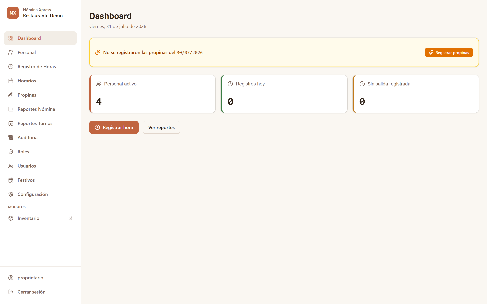

---

## 5. Personal (empleados)

**Propósito:** administrar la lista de empleados pagables (los que aparecen en la nómina).
**Quién:** SUPERADMIN y PROPRIETARY (permiso "Personal"). El ADMIN no gestiona personal.

**Crear un empleado — pasos:**
1. Menú lateral → **Personal**.
2. Botón **Nuevo personal** (arriba a la derecha).
3. Completa: **nombre** (obligatorio), documento, teléfono, **tarifa normal por hora**,
   **tarifa especial por hora** (domingos/festivos), **% de propina** y **tipo de pago**
   (Nómina o Turno).
4. **Guardar**.

> Desde esta misma pantalla, los botones **Gestionar bonos** y **Gestionar descuentos**
> abren la configuración de bonos y descuentos recurrentes (ver [sección 9](#9-bonos-y-descuentos)).

**Datos requeridos:** nombre y tarifas (las demás son opcionales).
**Resultado esperado:** el empleado aparece en la lista y queda disponible para registrar
horas, horarios, propinas y nómina.

**Otras acciones:** editar datos, **activar/desactivar** un empleado y **gestionar sus
credenciales** (crear/actualizar su cuenta de acceso al portal).

**Errores / situaciones comunes:**
- *Falta el nombre o las tarifas:* el formulario no deja guardar.
- Al **desactivar** un empleado, deja de contar para nuevas nóminas; los datos históricos
  se conservan.

**Recomendación:** define bien las tarifas normal y especial antes de generar la primera
nómina; cambiarlas después no recalcula quincenas ya pagadas hacia atrás salvo que
reproceses el reporte.

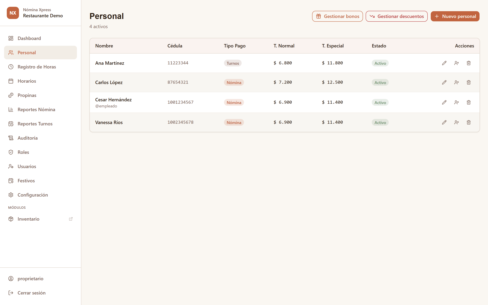

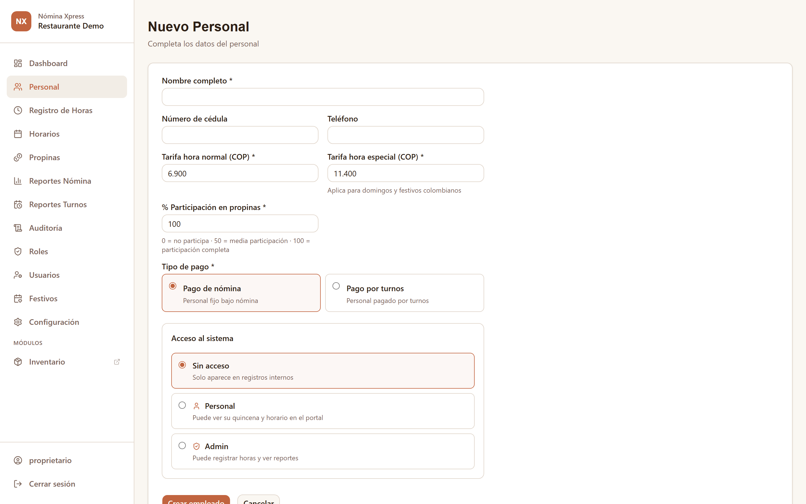

---

## 6. Registro de horas

**Propósito:** registrar las horas trabajadas por cada empleado, día a día.
**Quién:** ADMIN, SUPERADMIN, PROPRIETARY (permiso "Registro de horas").

**Registrar horas — pasos:**
1. Menú lateral → **Registro de Horas**.
2. Botón **Registrar horas** (arriba a la derecha).
3. Elige el **empleado** y la **fecha**. Si la fecha es domingo o festivo verás la
   etiqueta **Domingo / Festivo** junto al campo.
4. Ingresa **hora de entrada** y **hora de salida**. Dejar la salida vacía registra
   **solo la entrada** (turno abierto, que luego completas).
5. Si hubo **turno partido**, pulsa **Agregar turno partido (2.º turno)** e ingresa el
   segundo bloque.
6. **Registrar horas**.

**Datos requeridos:** empleado, fecha y entrada (la salida y el segundo bloque son
opcionales).
**Resultado esperado:** el registro queda guardado; si la fecha es **domingo o festivo**,
el sistema lo marca automáticamente como **especial** (tarifa especial). No necesitas
marcarlo tú.

### Turnos que cruzan la medianoche

Si la salida es **anterior o igual** a la entrada, el sistema entiende que el turno
**terminó en la madrugada del día siguiente** y muestra la etiqueta **+1 día**. Ese cruce
se permite **hasta las 2:00 a. m.**; una salida posterior se rechaza con el mensaje
*"La salida solo puede cruzar la medianoche hasta las 2:00 AM"*.

Todas las horas del turno —incluidas las de la madrugada— se pagan con la tarifa del
**día en que empezó**. Por ejemplo, un turno del domingo 7:00 p. m. a 1:00 a. m. se paga
completo a **tarifa especial**.

### Topes y avisos de jornada

- **Aviso a partir de 8 horas:** si con el registro que estás guardando el empleado
  supera las **8 horas** en ese día, aparece una confirmación con el detalle de los
  turnos del día. Puedes **Revisar** (volver a corregir) o **Sí, registrar** (confirmar).
  No es un bloqueo: es una salvaguarda contra errores de digitación.
- **Tope de 15 horas diarias:** el sistema **no permite** que la suma de los turnos de un
  empleado en un mismo día supere las **15 horas**.
- **Máximo 2 turnos por día** y por empleado, y **sin solaparse** entre sí.

### Buscar, filtrar y paginar

La lista tiene filtros de **Desde / Hasta**, **Personal** y **Por página** (10, 15 o 20
registros; por defecto 15). Los filtros se conservan al cambiar de página.

**Editar un registro:** el ícono de lápiz permite corregir horas, fecha y **también
reasignar el registro a otro empleado**. Al mover el registro se vuelven a validar las
reglas del día destino (máximo 2 turnos, sin solapes y tope de 15 h).

**Errores / situaciones comunes:**
- *Salida antes de la entrada (más allá de las 2 a. m.):* revisa las horas.
- *"El empleado ya tiene 2 registros para este día":* edita uno de los existentes en
  lugar de crear un tercero.
- *"El total de horas del día superaría el máximo de 15 h":* revisa si hay un registro
  duplicado o mal digitado.
- *Día especial no reconocido:* si es un festivo local decretado, regístralo en
  [Festivos](#16-festivos); el sistema recalcula los turnos ya guardados de esa fecha.

**Recomendación:** registra las horas al día o al cierre de cada jornada para que la
nómina de la quincena esté completa.

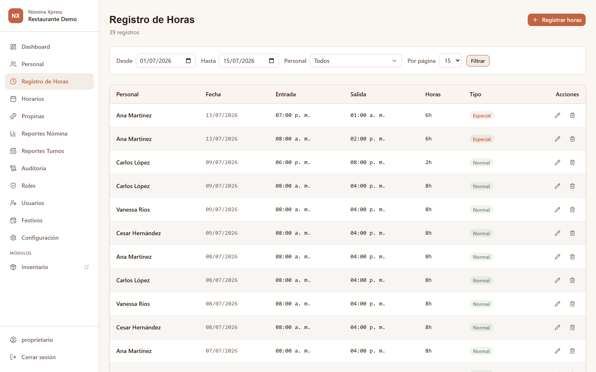

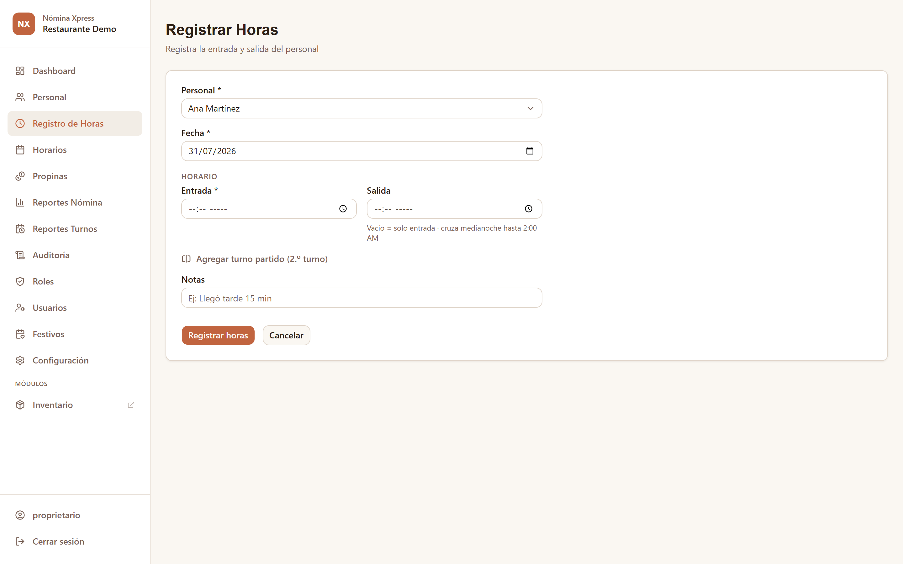

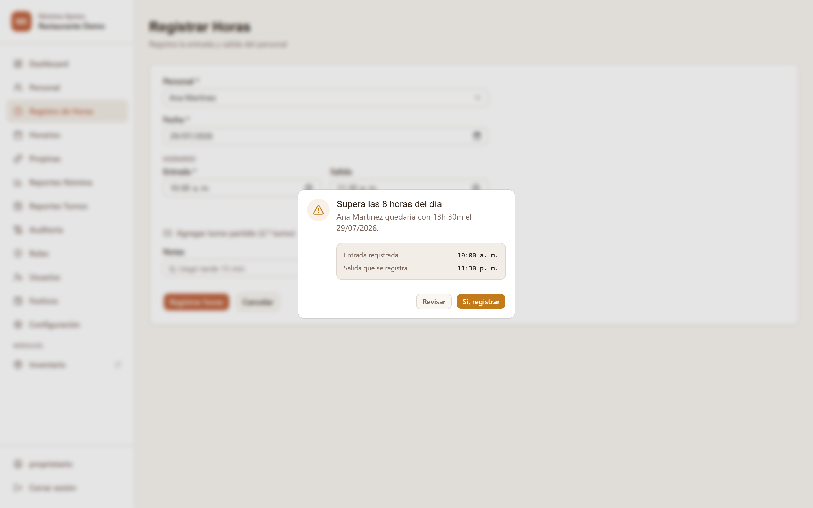

---

## 7. Horarios

**Propósito:** planificar los turnos de la semana y publicarlos para que los empleados
los vean.
**Quién:** crear/editar/publicar → SUPERADMIN y PROPRIETARY. El ADMIN puede **ver**.

**Crear y publicar un horario — pasos:**
1. Menú lateral → **Horarios**.
2. **Nuevo horario**; define el **inicio de semana** y un nombre.
3. Asigna **turnos** por empleado y día (hora de inicio y fin; opcional un segundo bloque).
4. Guarda y luego usa **Publicar** para que sea visible en el portal del empleado.

**Datos requeridos:** semana, empleados y horarios de sus turnos.
**Resultado esperado:** un horario **publicado** aparece en "Mi Horario" de cada empleado.

**Errores / situaciones comunes:**
- Un horario **no publicado** no lo ve el empleado. Recuerda **Publicar**.
- Puedes **despublicar** para editarlo y volver a publicar.

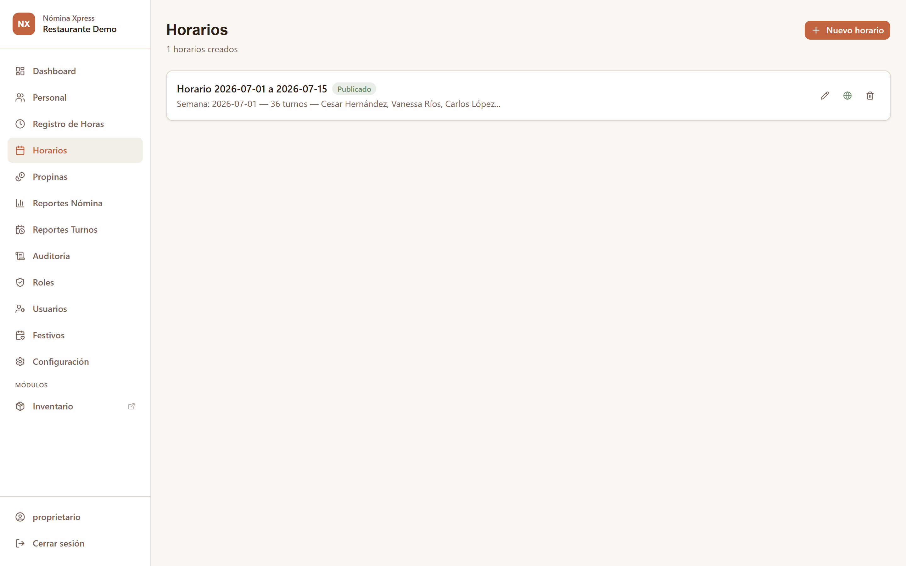

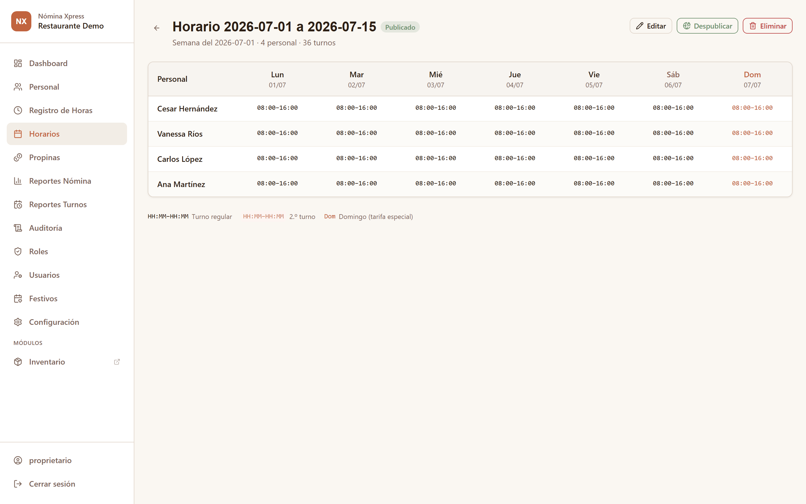

---

## 8. Propinas

**Propósito:** registrar la propina total de un día y repartirla automáticamente entre
los empleados que trabajaron.
**Quién:** ADMIN, SUPERADMIN, PROPRIETARY (permiso "Propinas").

**Registrar una propina — pasos:**
1. Menú lateral → **Propinas**.
2. **Registrar propinas**; elige la **fecha**, ingresa el **total de propinas (COP)** del
   día y, si quieres, una nota.
3. **Registrar y distribuir**.
4. El sistema calcula: **menaje 10%**, **neto** = total − menaje, y **reparte el neto**
   proporcionalmente a las **horas efectivas** de cada empleado (horas × su % de propina).

**Datos requeridos:** fecha y monto total.
**Resultado esperado:** ver el reparto por empleado (horas efectivas, propina por hora y
monto) y el menaje apartado. La pantalla resume el período con tres tarjetas: **Total
propinas brutas**, **Provisión menaje (10%)** y **Total distribuido**, y permite ver el
detalle **Por día** o **Por personal**.

**Errores / situaciones comunes:**
- *Ya existe una propina para esa fecha:* solo se permite **una propina por día**; edita
  la existente.
- Si un empleado no tiene horas ese día, no recibe reparto.

**Recomendación:** registra las propinas del mismo día para que coincidan con las horas
trabajadas registradas.

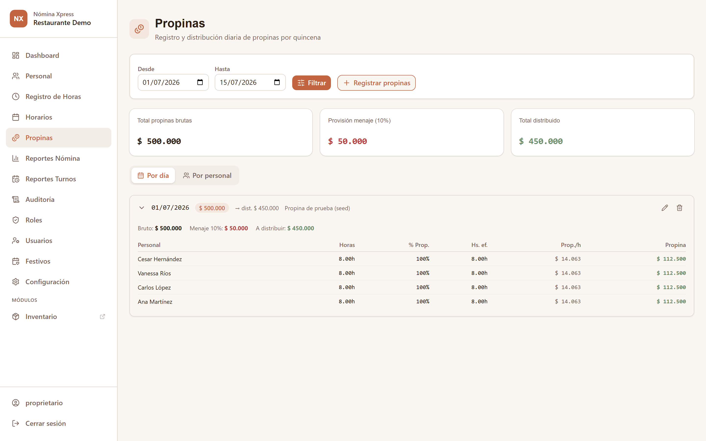

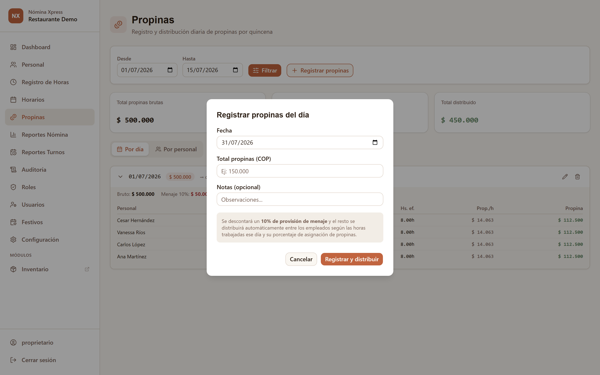

---

## 9. Bonos y descuentos

**Propósito:** definir bonos (suman) y descuentos (restan) que se aplican
**automáticamente en la nómina** de la quincena.
**Quién:** SUPERADMIN y PROPRIETARY (permisos "Bonos" / "Descuentos").

**Crear un bono o descuento — pasos:**
1. Menú lateral → **Personal** → botón **Gestionar bonos** o **Gestionar descuentos**
   (arriba a la derecha).
2. **Nuevo bono** / **Nuevo descuento**; define:
   - **Nombre** y descripción.
   - **Tipo de valor:** *Estándar* (mismo monto para todos) o *Por empleado* (monto por asignación).
   - **A quién aplica:** *Todos*, *Nómina*, *Turno* o *Específico* (empleados que elijas).
   - **Frecuencia:** *Quincenal* o *Mensual* (y si es mensual: primera quincena, segunda o dividido).
   - **Monto** (si es Estándar) o **asignaciones por empleado** (si es Por empleado).
3. Guarda y **actívalo**.

**Datos requeridos:** nombre, tipo, alcance, frecuencia y monto/asignaciones.
**Resultado esperado:** en el **Reporte de Nómina** de cada quincena, el bono/descuento
aparece aplicado a los empleados que corresponde, sin registrarlo manualmente cada vez.

**Errores / situaciones comunes:**
- Un bono **mensual de segunda quincena** no aparece en la primera (es normal).
- Un bono **Por empleado** sin asignación/monto no se aplica a ese empleado.
- Un bono **inactivo** no se aplica.

**Recomendación:** usa bonos/descuentos para lo recurrente (auxilio de transporte, cuota
de préstamo) y los **ajustes de pago** (sección 10) para casos puntuales de un período.

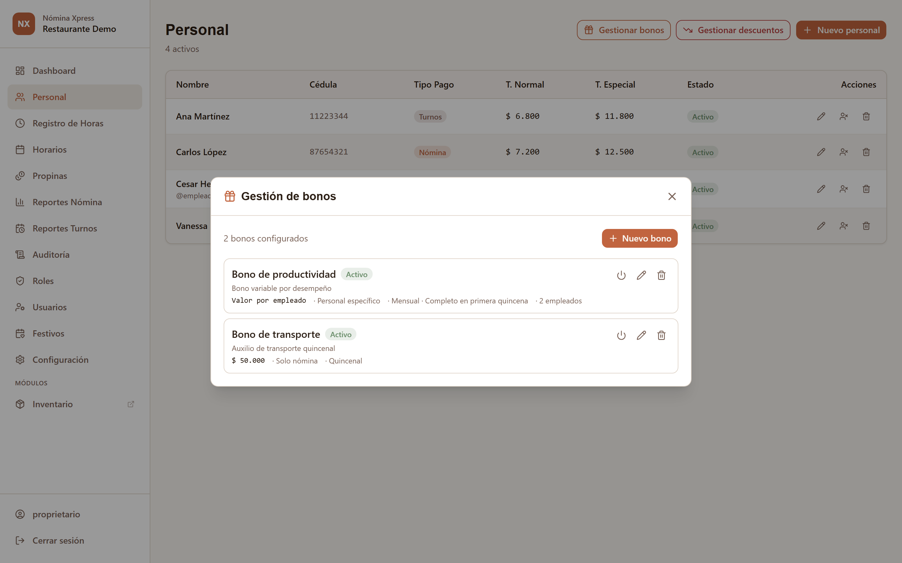

---

## 10. Ajustes de pago

**Propósito:** sumar o restar un monto puntual a un empleado para un período concreto.
**Quién:** SUPERADMIN y PROPRIETARY (permiso "Ajustes de pago").

**Pasos:**
1. Genera el **Reporte de Nómina** del período (sección 11).
2. En la fila del empleado, pulsa **+ Ajuste** (columna **Acción**).
3. Elige el tipo **Bono** (suma) o **Descuento** (resta), escribe el **monto (COP)** y la
   **descripción**.
4. **Guardar ajuste**. Si el empleado ya tenía un ajuste en ese período, el modal aparece
   como **Editar ajuste** y el botón como **Actualizar ajuste**.

**Datos requeridos:** empleado, período, tipo, monto y descripción.
**Resultado esperado:** el ajuste se refleja en el total del empleado en ese período.

**Diferencia con bonos/descuentos:** los ajustes son **puntuales para un período**; los
bonos/descuentos son **reglas recurrentes**.

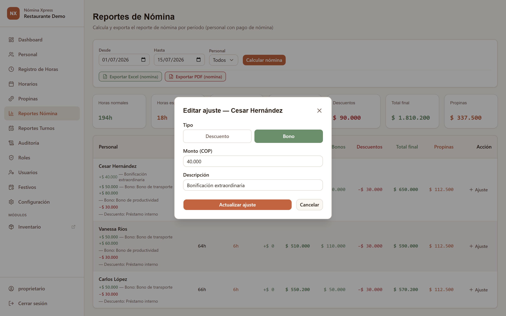

---

## 11. Reportes de nómina (PDF/Excel)

**Propósito:** ver y exportar la liquidación de la quincena/mes por empleado.
**Quién:** ADMIN, SUPERADMIN, PROPRIETARY (permiso "Nómina").

**Generar un reporte — pasos:**
1. Menú lateral → **Reportes Nómina**.
2. Selecciona el **período** (**Desde** / **Hasta**; por defecto la quincena actual) y,
   si quieres, un empleado concreto en **Personal**.
3. Pulsa **Calcular nómina**.
4. Revisa las tarjetas de totales y la tabla: **horas normales y especiales**,
   **ajustes**, **neto**, **bonos**, **descuentos**, **total final** y **propinas**
   (informativas).
5. Usa **Exportar PDF (nomina)** o **Exportar Excel (nomina)** para descargar.

**Datos requeridos:** período.
**Resultado esperado:** consolidado en pantalla y archivo PDF/Excel descargado.

**Cómo se calcula el total:** `bruto = horas normales × tarifa normal + horas especiales
× tarifa especial`; luego se suman bonos y ajustes-bono y se restan descuentos y
ajustes-descuento. El **total final nunca es negativo**. Las **propinas no se suman** al
total pagable (son informativas).

**Errores / situaciones comunes:**
- *Totales incompletos:* faltan registros de horas de algún día → complétalos y vuelve a
  generar.
- La exportación queda registrada en la auditoría.

**Recomendación:** revisa el reporte en pantalla antes de exportar y pagar.

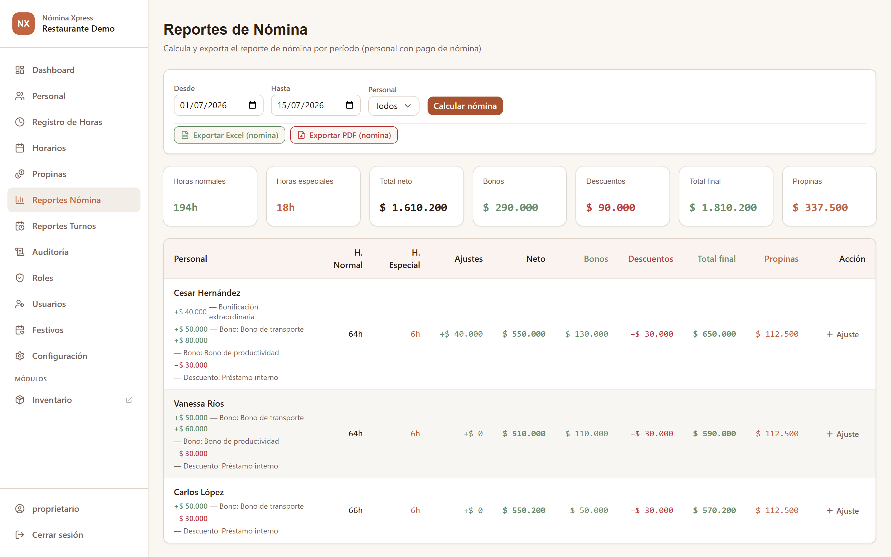

---

## 12. Reportes de turnos

**Propósito:** consultar y liquidar al personal con **tipo de pago "Turno"** en un
período.
**Quién:** mismos permisos que Reportes de nómina.

**Pasos:** Menú lateral → **Reportes Turnos** → selecciona el período → **Calcular
turnos** → revisa y exporta con **Exportar PDF (turnos)** / **Exportar Excel (turnos)**.
**Resultado esperado:** detalle de turnos por empleado en el período elegido.

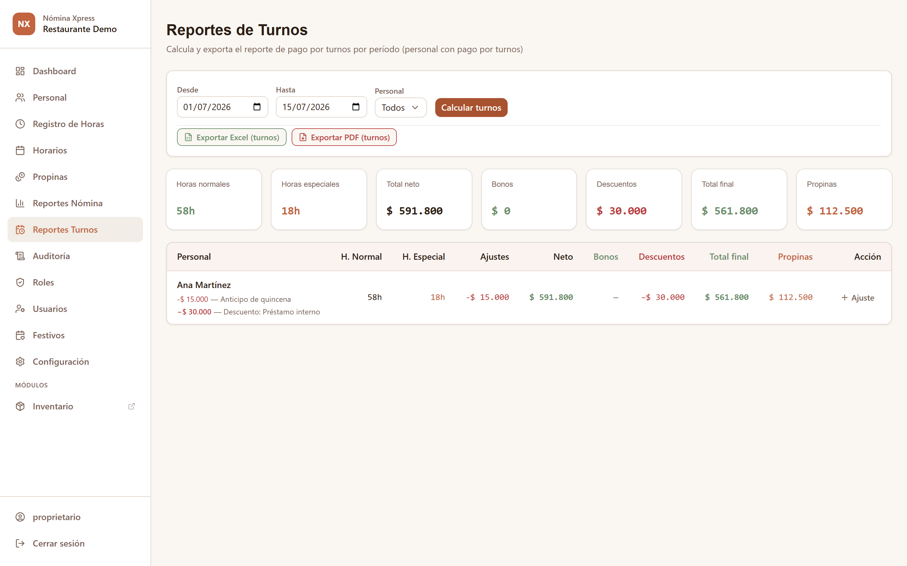

---

## 13. Usuarios

**Propósito:** administrar las **cuentas de acceso** al sistema (usuarios del portal).
**Quién:** PROPRIETARY (y quien tenga el permiso "Usuarios").

**Crear un usuario — pasos:**
1. Menú lateral → **Usuarios** → **Nuevo usuario**.
2. Define **nombre de usuario**, **contraseña** y **rol** (Propietario, Superadmin, Admin
   o Empleado).
3. Opcional: vincúlalo a un **empleado** y asígnale un **rol personalizado** o **permisos
   individuales**.
4. Guarda.

**Datos requeridos:** usuario, contraseña y rol.
**Resultado esperado:** la persona ya puede iniciar sesión con ese usuario/contraseña.

**Otras acciones:** editar, activar/desactivar y gestionar los **permisos individuales**
de un usuario (conceder o denegar acciones concretas por encima de su rol).

**Errores / situaciones comunes:**
- *Nombre de usuario repetido:* debe ser único.
- Los cambios de rol/permisos aplican **tras re-login** del usuario afectado.

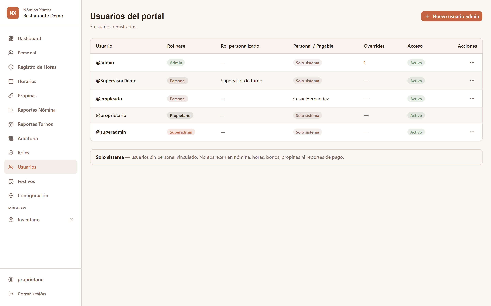

---

## 14. Roles y permisos

**Propósito:** crear **roles personalizados** con un conjunto específico de permisos, para
no depender solo de los cuatro roles base.
**Quién:** PROPRIETARY (permiso "Roles").

**Crear un rol personalizado — pasos:**
1. Menú lateral → **Roles** → **Nuevo rol**.
2. Define **nombre del rol**, **identificador (slug)** —único y no editable después— y
   la descripción.
3. Marca los **permisos** por módulo (ver horas, crear horas, ver propinas, ver nómina,
   etc.) en la **matriz de permisos**. La casilla del encabezado de cada módulo marca o
   desmarca el grupo completo.
4. Guarda y actívalo. Luego asígnalo a un usuario desde **Usuarios**.

**Datos requeridos:** nombre y selección de permisos.
**Resultado esperado:** el rol queda disponible para asignarlo; un usuario con ese rol
usa **exactamente** esos permisos (reemplaza a su rol base).

**Cómo se combinan los permisos:**
1. **Propietario** siempre tiene todo.
2. Si el usuario tiene un **rol personalizado activo**, usa los permisos de ese rol.
3. Si no, usa los de su **rol base**.
4. Encima se aplican los **permisos individuales** del usuario (conceden o quitan).

**Errores / situaciones comunes:**
- Un usuario con un rol personalizado que otorga acciones admin **sí** entra al área
  admin (aunque su rol base sea Empleado).
- Recuerda: los cambios aplican **tras re-login**.

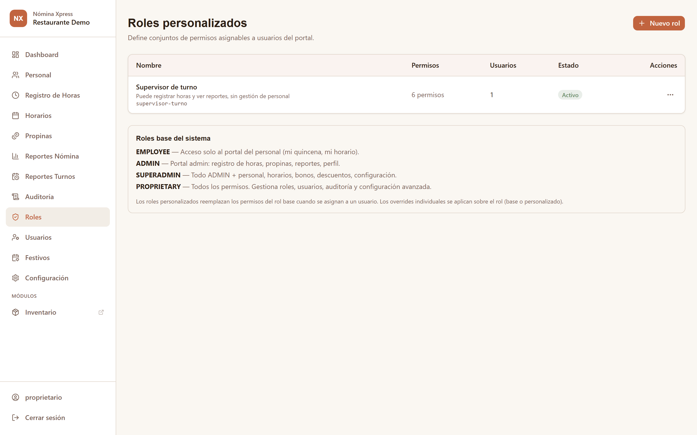

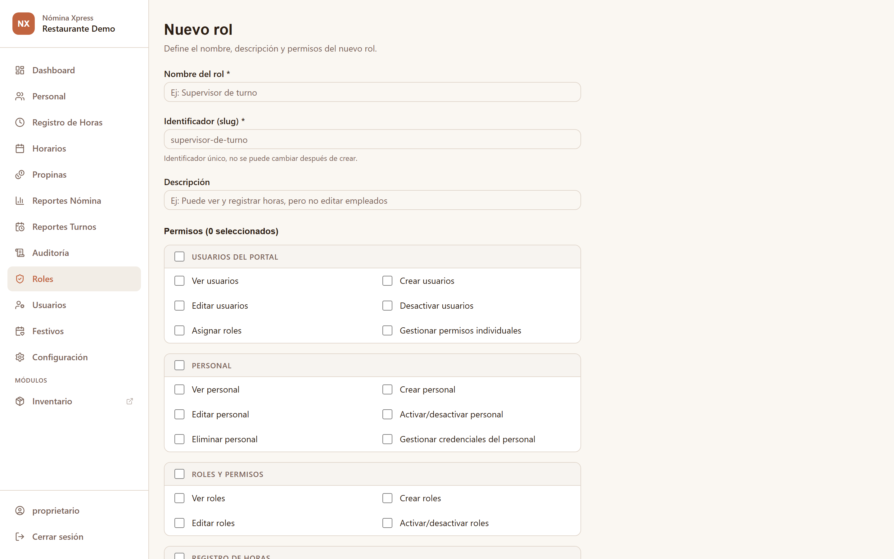

---

## 15. Auditoría

**Propósito:** consultar el historial de todas las acciones importantes del sistema.
**Quién:** **solo el Propietario** por defecto (permiso "Auditoría").

**Pasos:** Menú lateral → **Auditoría** → revisa la lista. Cada registro muestra **quién**,
**qué acción**, **sobre qué**, **cuándo**, el resultado y (en ediciones) **qué cambió**.

**Resultado esperado:** trazabilidad completa: inicios de sesión (incluidos fallidos),
creación/edición/eliminación de datos, publicaciones, exportaciones, etc.

**Notas:**
- El historial es **inmutable**: no se puede editar ni borrar desde la app.
- Se conserva por **6 meses** (configurable) y luego se purga automáticamente.

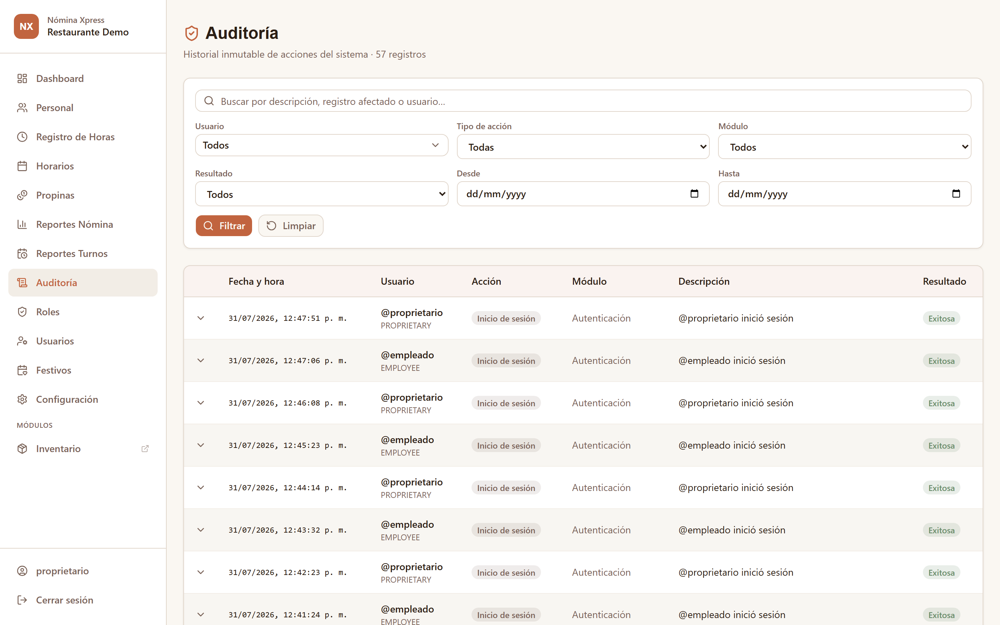

---

## 16. Festivos

**Propósito:** controlar qué días paga el sistema con **tarifa especial**.
**Quién:** SUPERADMIN y PROPRIETARY (permisos "Festivos").

La pantalla tiene dos bloques:

**1. Festivos nacionales (solo lectura).** Los festivos colombianos de la Ley Emiliani.
El sistema los aplica **automáticamente** y **no** se pueden editar. Puedes consultarlos
por año con el selector de la derecha.

**2. Festivos personalizados.** Días decretados localmente (municipales, fiestas
patronales, decretos puntuales) que el calendario nacional no incluye.

**Crear un festivo personalizado — pasos:**
1. Menú lateral → **Festivos** → **Nuevo festivo**.
2. Escribe el **nombre** (ej. *Ntra. Sra. del Rosario de Chiquinquirá*).
3. Elige **mes** y **día**.
4. Elige la **vigencia**:
   - **Cada año:** el día se repite todos los años (fiesta patronal fija).
   - **Solo un año:** indica el año; aplica únicamente a esa fecha (decreto puntual).
5. **Registrar festivo**.

**Datos requeridos:** nombre, mes, día y vigencia.
**Resultado esperado:** el día pasa a pagarse como **especial**. Además, el sistema
**recalcula los turnos ya registrados** en esa fecha: no hay que volver a capturarlos.

**Errores / situaciones comunes:**
- *No puedes crear dos festivos con la misma fecha y vigencia:* edita el existente.
- Al **eliminar** un festivo personalizado, los turnos de esa fecha **dejan de pagarse
  como especiales** (salvo que además sean domingo o festivo nacional). El sistema avisa
  antes de borrar.
- Un festivo **recurrente** (cada año) afecta los turnos de **todos los años** con ese
  mes/día; uno **puntual**, solo los de esa fecha exacta.

**Recomendación:** registra los festivos locales **antes** de cerrar la quincena; aunque
el recálculo es retroactivo, así evitas revisar totales dos veces.

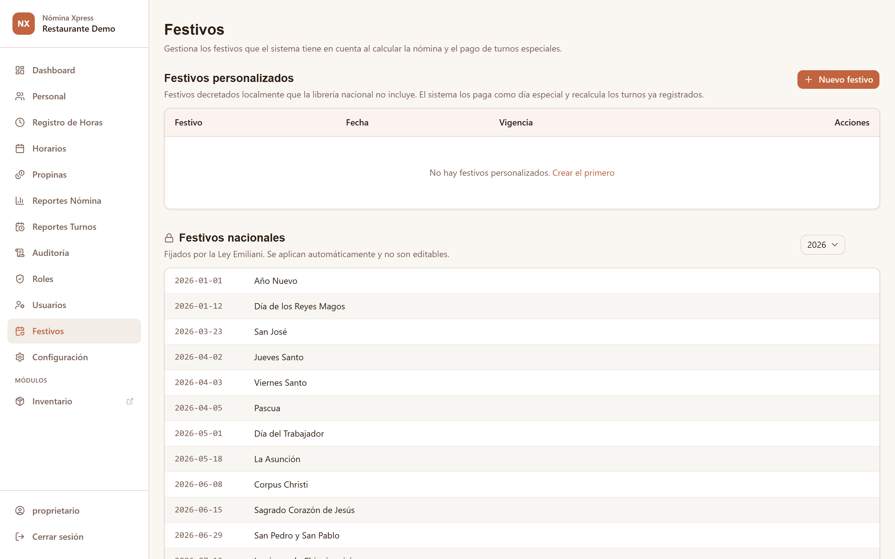

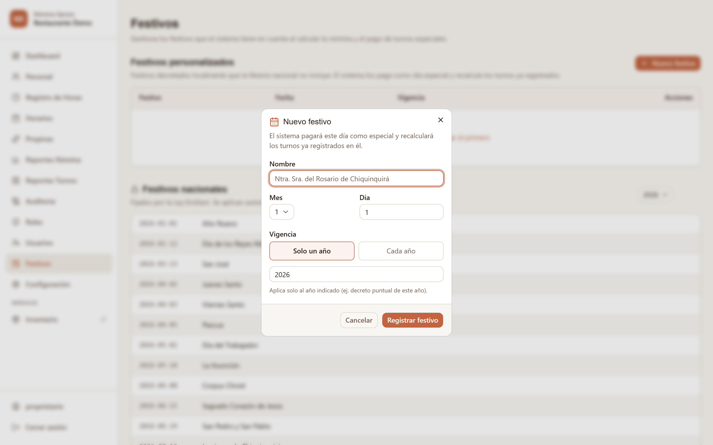

---

## 17. Configuración del restaurante

**Propósito:** personalizar la marca del restaurante.
**Quién:** SUPERADMIN y PROPRIETARY (permiso "Configuración").

**Pasos:**
1. Menú lateral → **Configuración**.
2. Cambia el **nombre**, los **colores** (primario/secundario) y sube el **logo**.
3. Guarda.

**Datos requeridos:** los que desees cambiar.
**Resultado esperado:** el sistema muestra tu logo y colores; el texto se ajusta
automáticamente para mantener buen contraste y legibilidad.

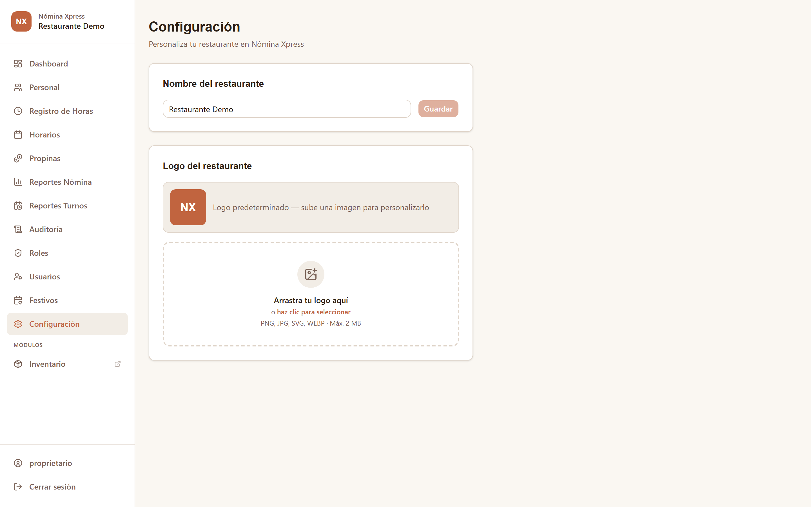

---

## 18. Mi perfil

**Propósito:** ver tu cuenta y **cambiar tu contraseña**.
**Quién:** todos los usuarios del área admin.

**Pasos:** menú lateral (abajo, con tu nombre) → **Perfil** → cambia tu contraseña →
guarda.
**Resultado esperado:** contraseña actualizada; úsala en el próximo inicio de sesión.

> **ADMIN con empleado vinculado:** además verás **Mi Quincena** y **Mi Horario** dentro
> del área admin, igual que un empleado.

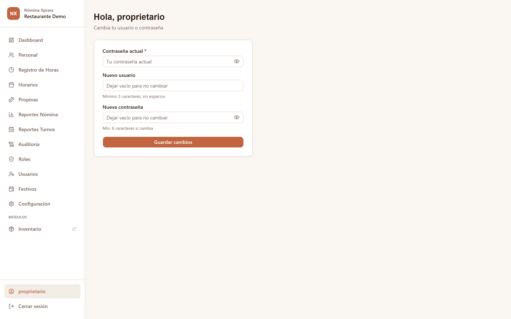

---

## 19. Mi Quincena

**Propósito:** que el **empleado** consulte su liquidación del período actual.
**Quién:** empleados (portal).

**Pasos:** inicia sesión → llegas a **Mi Quincena** (o pulsa esa opción arriba). Puedes
cambiar el rango **Desde / Hasta** para consultar otra quincena.
**Resultado esperado:** ver tus **horas** (normales y especiales), tu **pago bruto** y
**pago estimado neto**, las **propinas acumuladas**, los **bonos** y **descuentos** de la
quincena, el **total estimado final** y el detalle de **tus registros** día por día.

> Los valores son **estimados** con la información registrada hasta ese momento; el valor
> definitivo es el del reporte de nómina que emite la administración.

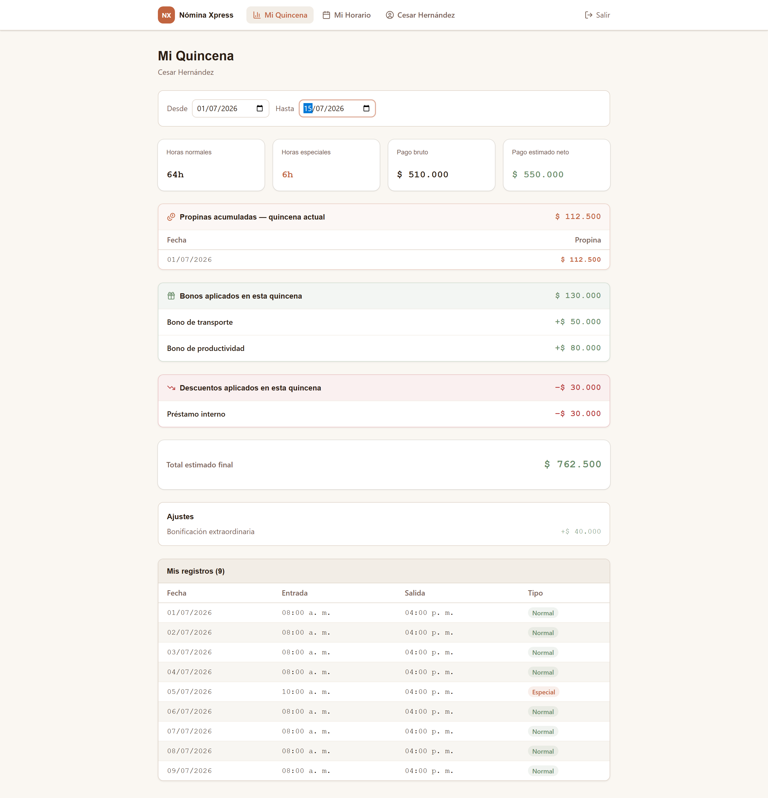

---

## 20. Mi Horario

**Propósito:** que el empleado vea sus **turnos publicados**.
**Quién:** empleados (portal).

**Pasos:** en el portal, pulsa **Mi Horario**.
**Resultado esperado:** ver los turnos de la semana publicados por el administrador.

**Situación común:** si no ves turnos, es que el horario **aún no fue publicado**.

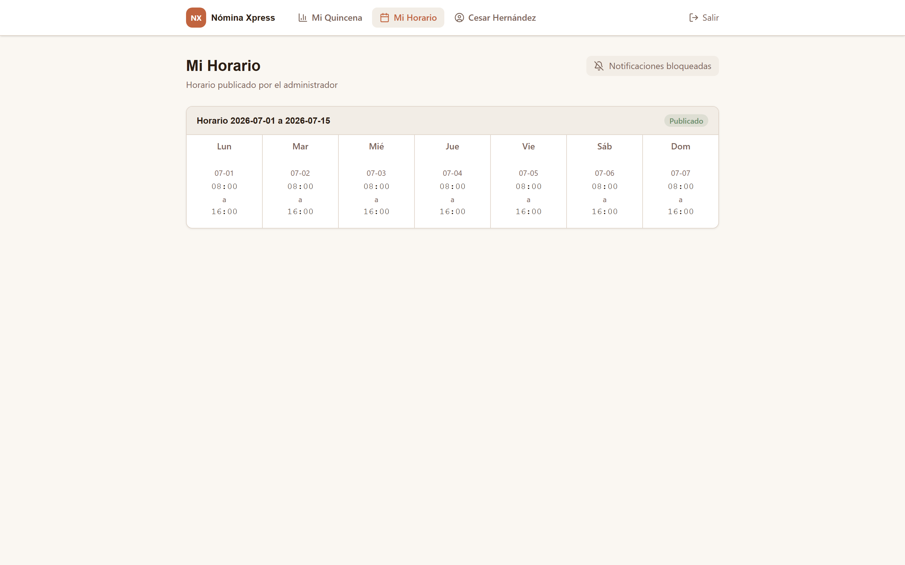

---

## 21. Perfil del empleado y notificaciones

**Propósito:** cambiar la contraseña y **activar notificaciones push** (avisos en el
dispositivo).
**Quién:** empleados (portal).

**Pasos:**
1. En el portal, pulsa tu **nombre** (Perfil).
2. Cambia tu contraseña si lo deseas.
3. Activa las **notificaciones** (el navegador pedirá permiso).

**Resultado esperado:** contraseña actualizada y, si activaste notificaciones, avisos en
tu dispositivo.

**Situación común:** si bloqueaste los permisos del navegador, deberás habilitarlos desde
la configuración del navegador para recibir notificaciones.

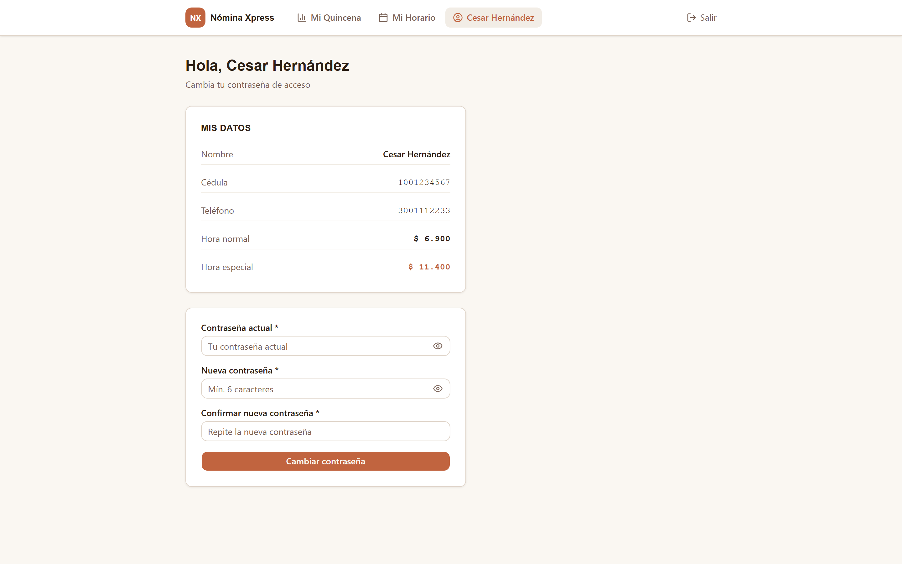

---

## 22. Preguntas frecuentes

**¿Por qué no veo una opción del menú?**
Tu rol no incluye ese permiso. Pide a un Propietario/Superadmin que te lo asigne.

**Cambié un permiso/rol y no se refleja.**
Los cambios de permisos aplican **tras cerrar e iniciar sesión** de nuevo.

**¿Por qué un día se pagó con tarifa más alta?**
Fue **domingo**, **festivo nacional** o un **festivo personalizado** registrado por la
administración: se paga con **tarifa especial** automáticamente.

**El pueblo decretó un festivo local y el sistema no lo reconoce.**
Regístralo en **Festivos → Nuevo festivo** ([sección 16](#16-festivos)). Al guardarlo, el
sistema **recalcula los turnos ya registrados** de esa fecha.

**Trabajé de 7 p. m. a 1 a. m. ¿En qué día quedan esas horas?**
En el **día en que empezó** el turno, y todas se pagan con la tarifa de ese día. El
sistema admite cruzar la medianoche **hasta las 2:00 a. m.**

**Al guardar un registro me pidió confirmar porque "supera las 8 horas".**
Es solo un aviso para evitar errores de digitación. Revisa los datos y, si son correctos,
pulsa **Sí, registrar**. El límite que sí bloquea es el de **15 horas** en un mismo día.

**¿Las propinas se suman a mi pago de nómina?**
Se muestran como información, pero **no** se suman al total pagable de la nómina.

**No puedo iniciar sesión.**
Revisa usuario/contraseña (distingue mayúsculas). Si tu cuenta fue **desactivada**, un
administrador debe reactivarla.

**¿Cada cuánto se maneja la nómina?**
Por **quincenas**: del 1 al 15 y del 16 al fin de mes.

---

## 23. Cómo actualizar este manual

*(Sección para quien mantiene la documentación, no para el usuario final.)*

Las capturas se generan automáticamente contra la aplicación real. Para regenerarlas
después de un cambio de interfaz:

```bash
npx tsx prisma/seed-local.ts && npm run dev
```

y, en otra terminal:

```bash
npm run docs:screenshots
```

El script inicia sesión con las credenciales del seed de demostración, recorre cada
pantalla y sobrescribe los PNG de `docs/img/` con los mismos nombres que referencia este
documento. El período que retrata se controla con `PERIOD_FROM` / `PERIOD_TO`.

Después, para regenerar los PDF (este manual y la documentación técnica) con las
capturas nuevas embebidas:

```bash
npm run docs:pdf
```

`scripts/build-docs-pdf.mjs` convierte cada `.md` a HTML y lo imprime a PDF con el
Chromium de Playwright (sin depender de pandoc/wkhtmltopdf ni de internet). Falla con un
error explícito si alguna imagen referenciada no carga, así que un PDF generado sin
errores es prueba de que todas las capturas están presentes y enlazadas.
